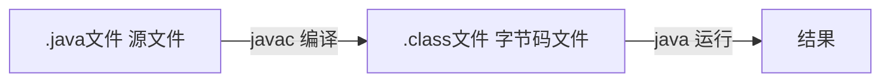
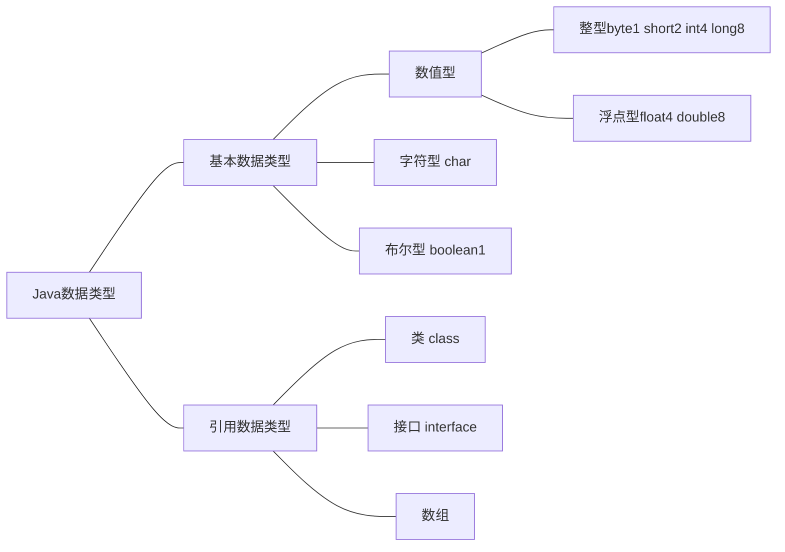

# JavaSE #
---
## 第一章 Java概述 ##
### Java技术平台 ###
Java SE 标准版
	支持面向桌面级应用的java平台，提供完整的Java核心
Java EE 企业版
	为开发企业环境下的应用程序提供的一套解绝方案，含Servlet,Jsp 等，主要针对Web应用程序开发。
Java ME 小型版
	支持Java程序运行在移动终端上的平台
### Java重要特点 ###
1 Java语言面向对象(oop)
2 Java语言是健壮的
	java的强类型机制，异常处理，垃圾自动回收等是Java程序健壮性的重要保证
3 Java语言是跨平台性的
	依赖于Java核心机制JVM(Java虚拟机),对于不同平台，利用不同虚拟机，屏蔽底层运行平台的差别。
4 Java 语言是解释型的
### Java开发工具 ###
sublime,IDEA,Eclipse...

JDK (Java Development Kit	Java开发工具包)
	JDK = JRE + Java开发工具(Javac,Java编译工具等...)
JRE(Java Runtime Environment	Java 运行环境)
	JRE = JVM + Java核心类库
### Java执行流程 ###

### Java开发注意细节 ###
1 .java扩展名，源文件基本组成是类
2 执行入口main()方法，固定格式
	public static void main(String[] args){}
3 Java 语言严格区分大小写
4 语句以；结尾
5 一个源文件最多一个public类，且文件名按其命名
### Java转义字符 ###
常用
\t :制表符对齐
\\n :换行符
\\\ :一个\
\\" :一个"
\\' :一个'
\r :一个回车
### Java注释 ###
代码注释
```Java
// 单行注释
/* 多行注释 */
```
文档注释
注释内容可以被JDK提供的工具Javadoc所解析，生成一套以网页文件形式体现的改程序的说明文档
javadoc -d 文件夹名 -xx -yy Demo3.java
```Java
/**
  *@author 韩顺平
  *@verson 1.0
  */
javadoc -d d:\\temp -author -version Commects.java
```
### DOS 命令了解 ###
相对路径 如 ..\..\abc\hello.txt
绝对路径 如 d:\abc\test\hello.txt

常用DOS命令
1 查看当前目录内容
	dir d:\abc\test
2 切换到其他盘下
	cd /D
3 切换到当前盘的其他目录下
	cd d:\abc\test\hello
4 切换到上一级
	cd ..
5 切换到根目录
	cd \
6 查看指定目录下的所有子集目录 tree
7 清屏 cls
8 退出 DOS exit
......
## 第二章 变量 ##
### Java 数据类型 ###

细节
* 声明long 型常量后加 'l' 或者 'L'
* 声明float型常量后加 'f' 或者 'F'
* 浮点数= 符号位+ 指数位+ 尾数位
* 科学计数法 5.12e2[5.12 * 10的2次方] 5.12E-2[5.12/10的2次方]
* char本质是整数，在输出时是unicode码对应字符
* boolean 类型占一个字节 取true或者false
### 编码表 ###
* ASCII 占一个字节，用前七位，128个字符（1）
* Unicode 一个英文字母和一个汉字都占用2个字节，包含所有世界符号，兼容ASCII码（2，2）
* UTF-8 变长编码方式，1-6个字节表示一个符号，字母1个字节，汉字3个字节。（1，3）
* GBK 字母1个字节，汉字2个字节（1，2）
### 类型转换 ###
自动类型转换
在赋值或运算时，精度小的自动转换为精度大的
	char -> int -> long -> float -> double
	byte -> short -> int -> long -> float -> double
细节
* 有多种数据类型运算，系统首先自动将所有类型数据转换成精度最大的再计算。
* 精度大的赋给精度小的变量报错，反之自动转换
* byte short char 之间不会相互自动转换，它们之间计算首先转为int类型
* boolean 不参与转换
* 表达式结果自动提升为操作数中最大类型
```Java
byte b1 = 10;
byte b2 = 10;
byte b3 = b1 + b2//报错
int n1 = 10;
b3 = 10;//报错
float num = n1 + 1.1//报错，double -> float
```
强制类型转换
精度大的数据类型转换为精度小的数据类型，产生精度溢出或降低
```Java
int m = 10;
char c = 10;
c = (char)m;//char 可以保存int常量值，但不能保存其变量值。
```
基本数据类型和String类型转换
1 基本数据类型转String
	基本类型值 + ""
2 String转基本数据类型
	基本类型的包装类调用parseXX方法,确保Strng类型数据能够转为有效数据，否则抛出异常。
```Java
int num = Integer.parseInt("123");
double num2 = Double.parseDouble("12.34");
boolean b = Boolean.parseBoolean("true");
```
## 第三章 运算符 ##
### 运算符介绍 ###
算术运算符 
\+  \-  *  /  %  ++  --
整数之间做除法只保留整数部分
i++和++i区别

关系运算符
== != < > <= >= instanceof(检查是否是类的对象)
返回Boolean值

逻辑运算符
|| && & | ^ !
短路与逻辑与，短路或逻辑或，逻辑异或
返回boolean值

赋值运算符
= += -= \*= %= 等
赋值预算符从右往左顺序

运算顺序，优先级细节
只有单目运算符，赋值运算符从右往左运算
运算符优先级表
### 标识符规则规范 ###
Java 命名字符序列为标识符，即可自己起名位置
标识符命名规则: 
1 由26个英文字母大小写,0-9,\_或$ 组成
2 数字不开头
3 不使用关键字和保留字，但可以包含
4 严格区分大小写，长度无限制
5 不含空格

标识符命名规范：
1 包名：多单词组成全部小写 aaa.bbb.ccc
2 类名,接口名：多单词组成，单词首字母大写：XxxYyyZzz(大驼峰)
3 变量名，方法名：多单词组成，第一个单词首字母小写，其余大写 xxxYyyZzz(小驼峰)
4 常量名：所有字母大写，多单词下划线连接XXX_YYY_ZZZ
### 键盘输入语句 ###
```java
import java.util.Scanner;
Scanner myScanner =new Scanner(System.in);
```
### 进制细节 ###
二进制：0b或者0B开头
八进制：数字0开头
十六进制：0x或者0X开头
进制转换细节

### 位运算及二进制 ###
正数原码，反码，补码三码合一
负数反码=原码符号位不变，其他位取反
负数补码=反码+1
java没有无符号数，最高位代表符号位
计算机运算以补码方式运算，结果看原码

位运算符
| 按位或
& 按位与
^ 按位异或
~ 按位取反
\>> 算数右移，符号位补高位
\<< 算数左移，0补低位
\>>> 逻辑右移高位补0
## 第四章 程序控制结构 ##
### 顺序控制 ###
程序从上而下逐行执行，没有跳转和判断
### 分支控制 ###
1 if-else
2 switch 
	表达式值必须与case后常量类型一致或者可以自动转换
	表达式中返回值必须是byte,short,int,char,enum(枚举类),String
	case子句中变量，必须是常量
### 循环控制 ###
1 for循环
2 while循环
3 do-while循环
### 程序控制语句 ###
break 跳出循环或者switch
continue 结束当前循环开启下一次循环
return 退出方法
## 第五章 数组，排序和查找 ##
### 数组介绍 ###
数组可以存放多个同一类型的数据，是引用类型
```java
int a[] = new int[5];
int b[];
b = new int[5];
int[] c =  new int[5];
int[] d;
d = new int[5];
int[] e = {1,2,3,4,5};//静态初始化
```
下标从0开始，越界报错
### 排序 ###
内部排序：将所有数据加载到内部存储器中排序
	包括 交换排序，选择排序，插入排序
外部排序：借助外部存储进行排序
	包括：合并排序，直接合并排序
```java
for(int i = 0; i < n-1; i++){
	for(int j = n-1; j > 0; j++){
		if(a[j] < a[j-1]){
			swap(a[j],a[j-1]);
		}
	}
}//冒泡排序演示
```
### 查找 ###
常用：顺序查找，二分查找
细节见数据结构
### 二维数组 ###
形式上 int[][]
理解为原来的一维数组的每个元素是一维数组，就构成二维数组
```java
int[][] a = int[1][2];//动态定义
int[][] b = {{1,3,4},{1,2,3}};//静态定义
```
## 第六章 面向对象编程(基础部分) ##
### 对象简介 ###
把事物特征，行为抽象出来化为对象的属性方法，完成对象实例构建。
对象在内存形式

### 属性 ###
属性又称成员变量，字段
一般是基本数据类型，也可以是引用数据类型
由访问修饰符控制属性访问范围
属性如果不赋值，有默认值，规则同数组
(int-0,short-0,byte-0,long-0,float-0.0,double-0.0,char-\u0000,boolean-false,String-null)
### 对象使用实例 ###
创建对象，访问对象属性
```java
Cat cat = new Cat();//只有动态创建，可以先声明再创建。
cat.name;
cat.age;
```
内存分配机制
1 栈——存放基本数据类型
2 堆——存放对象
3 方法区——常量池（常量，如字符串），类加载信息

创建对象流程
1 先加载类信息
2 在堆中分配空间，进行默认初始化
3 把地址赋给堆中标识符
### 成员方法 ###
修饰符，返回类型，方法名，形参列表，方法体
程序执行到方法，开辟独立栈空间进行执行，执行完毕return就返回原位置执行。
提高代码复用性，细节封装
传入参数为实参，方法定义参数为形参
同类直接调用，跨类对象名调用且涉及到修饰符
### 方法的递归调用 ###
向递归条件逼近
谁调用结果返回给谁
经典问题：迷宫问题，八皇后等
### 方法重载 ###
java类中多个同名方法存在，但形参列表不一致

使用细节：
1 方法名必须相同
2 形参列表必须不同
3 返回类型，修饰符无要求
### 可变参数 ###
Java中允许将多个同名同功能但参数个数不同的方法，封装成一个方法
数据类型... 形参名
```java
public int sum(int... nums){
	int res = 0;
	for(int i = 0; i < nums.length; i++){
		res += nums[i];
	}
}
```
细节：
1 可变参数实参为0个或任意多个
2 实参可以是数组
3 可变参数实质是数组
4 可变参数只在形参列表最后，且唯一只存在一个
### 作用域 ###
1 Java中主要变量是属性（全局变量）和局部变量
2 局部变量一般是成员方法中定义的变量
3 全局变量可以不赋值直接用，有默认值，局部变量必须赋值，没有默认值。
4 属性和局部变量可以重名，遵循就近原则
5 局部变量不能重名
6 均伴随它们相应的代码块而创建和销毁
7 全局变量可以加修饰符，局部变量不可以
### 构造器 ###
1 构造器没有返回值
2 方法名同类名
3 由系统调用构造器
4 类可以定义多个构造器，进行重载
5 没有定义构造器，系统自动生成默认无参构造器
6 一旦定义自己的构造器，默认构造器被覆盖，需要重新显示定义。
```java
class Dog{
	Dog(){};
	public Dog(String dName){
		//...
	}
}
```
### this ###
java虚拟机给每个对象分配this代表当前对象

1 this关键字可以用来访问当前类的属性，方法，构造器
2 this用于区分当前类的属性和局部变量
3 访问成员方法的语法：this.方法名（参数列表）
4 访问构造器语法：this(参数列表)；注意只能再构造器中使用，且放在第一条语句
5 this 不能在类的外部使用，只能在类定义的方法中使用。
```java
public class person{
	String name;
	person(){
		this("yyk");
	}
	public person(String name){
		this.name = name;
	}
}
```
## 第七章 面向对象编程(中级部分) ##
### 集成开发环境 ###
IDEA
最好的Java开发工具，支持HTML，CSS，PHP，MySQL，Python等

Eclipse
最优秀java开发IDE之一，基于java的可扩展开发平台

设置颜色主题
快捷键
	1 ctrl + d 删除当前行（自配）
	2 CTRL + alt + 向下光标 复制当前行（自配）
	3 CTRL + / 添加和取消注释
	4 ctrl + alt + L 快速格式化代码
	5 CTRL + H 查看类层级关系
	6 Ctrl + B 光标放在方法上，定位到方法
	7 alt + / 补全代码 
	8 alt + r 快速运行程序（自配）
	9 alt + insert 生成构造器等
	10 alt + enter 导入改行需要的类（自配auto import）
	11 .var 自动分配变量名
模板 / 自定义模板
### 包 ###
三大作用
1 区分相同名字的类
2 管理类
3 控制访问范围

语法
package 关键字，表示打包
```java
package com.hspedu;
package com.sina.crm.user;
```
包的本质是文件夹

包的命名
1 只能包含数字，字母，下划线，小圆点，但不能数字开头，不能关键字，保留字
2 小写字母+小圆点
3 一般是 com.公司名.项目名.业务名

常用包
1 Java.lang.\* 基本包，默认引入
2 java.util.\* 系统提供工具包
3 java.net.\* 网络包，网络开发
4 java.awt.\* java界面开发

引入包
需要哪个类就导入哪个类即可，不建议使用\*导入
```java
import java.util.Scanner;
import java.net.*;
```

注意事项和使用细节
1 package作用是声明当前类所在的包，放在类的最上面，且只有一句
2 import指令位置放在package下，可以多句，无顺序要求
### 访问修饰符 ###
| 访问级别 | 访问控制修饰符 | 同类 | 同包 | 子类 | 不同包 |
| :-----:| :-----: | :-----: | :-----: | :-----: | :-----: |
| 公开 | public | ✔ | ✔ | ✔ | ✔ |
| 受保护 | protected | ✔ | ✔ | ✔ | × |
| 默认 | 没有修饰符 | ✔ | ✔ | × | ×|
| 私有 | private | ✔ | × | × | × |
修饰符修饰类中属性，成员方法，以及类
只有默认和public 才能修饰类
### 封装 ###
封装就是把抽象出的数据和对数据的操作封装在一起，数据被保护在内部，程序其他部分只有通过被授权，才能对数据进行操作。

好处
1 隐藏实现细节
2 对数据进行验证

封装实现
1 属性私有化private
2 提供公共set方法，用于对属性判断赋值
3 提供公共get方法用于获取属性值
### 继承 ###

基本语法
class 子类 extends 父类{
}
1 子类会自动拥有父类定义的属性和方法
2 父类又叫超类，基类
3 子类又叫派生类

便利
1 提高代码复用性
2 代码的扩展性和维护性提高

细节问题
1 非私有属性方法子类可以直接访问，但是私有属性方法不能直接访问，要通过父类提供的公共方法去访问
2 子类必须调用父类的构造器完成父类初始化
3 当创建子类对象时，不管使用子类哪个构造器，默认情况下总会去调用父类的无参构造器，如果父类没有提供无参构造器，则必须在子类构造器中用super去指定使用父类哪个构造器完成对父类的初始化工作。
4 如果希望指定调用父类某个构造器，则显示调用super(参数列表)
5 super使用必须放在构造器第一行
6 super() 和 this() 都只能放在构造器第一行，因此这两个方法不能共存在一个构造器
7 Java所有类都是Object子类，Object类是所有类的基类
8 父类构造器的调用不限于直接父类，将一直往上追溯到Object类
9 单继承机制

继承本质 —— 建立查找关系
首先看子类是否有该属性
次寻找父类是否有该属性，直到Object
### super ###
super代表父类引用，用于访问父类属性，方法，构造器
1 super.属性名
2 super.方法名(参数列表)
3 super(参数列表) 只能放在构造器第一句

super便利和细节
1 分工明确，父类属性由父类初始化
2 当子类和父类中成员重名，为了访问父类成员用super，若无重名则super同this。
3 super访问不限于直接父类，遵循就近原则
### 方法重写/覆盖 ###
子类方法和父类方法名称，返回类型，参数相同则子类方法覆盖父类方法。

规则
1 子类方法形参列表，方法名称要同父类方法
2 返回类型相同或者子类
3 子类方法不能缩小父类方法权限
| 名称 | 发生范围 | 方法名 | 形参列表 | 返回类型 | 修饰符 |
| :-----: | :-----: | :-----: | :-----: | :-----: |:-----: |
| 重载 | 本类 | 必须一样 | 类型，个数，顺序至少有一个不同| 无要求 | 无要求 |
| 重写 | 父子类 | 必须一样 | 相同 | 相同或者子类 | 不缩小|
### 多态 ###
方法或对象具有多种形态。是面向对象第三大特征，多态建立在封装和继承基础之上。

多态体现
1 方法重写和重载就体现多态
2 对象多态
	一个对象的编译类型和运行类型可以不一致
	编译类型在定义对象时就确定了，不能改变
	运行类型可以变化
	编译类型看定义时=号左边，运行类型看=号右边

多态细节
多态前提时两个类具有继承关系
多态的向上转型
	1 本质：父类的引用指向子类的对象
	2 语法：父类类型 引用名 = new 子类类型();
	3 特点：编译类型看左边，运行类型看右边
	可以调用父类中所有成员（需遵守访问权限）
	不能用子类中特有成员
	最终运行效果看子类的具体实现
多态的向下转型
	1 语法：子类类型 引用名 = (子类类型) 父类引用
	2 只能强转父类引用，不能强转父类的对象
	3 要求父类引用必须指向当前目标类型的对象
	4 当向下转型后可以调用子类类型中所有成员
### Java动态绑定机制 ###
当调用对象方法时，该方法会和对象内存地址/运行类型绑定。
当调用对象属性时，没有动态绑定机制，哪里声明哪里使用。

多态参数
方法定义的形参类型为父类类型，实参允许为子类类型
### Object类 ###
equals方法是Object类中方法，只能判断引用类型，默认判断地址是否相等，子类往往重写该方法，用于判断内容是否相等(Integer,String等)。

== 是比较运算符
1 == 既可以判断基本类型又可以判断引用类型
2 == 如果判断基本类型，判断的是值是否相等
3 == 如果判断引用类型，判断的是地址是否相等

重写equals方法
```java
public boolean equals(Object obj){
	if(this == obj){
		return true;//查看地址是否相同
	}
	if( Obj instanceof Person){
		Person p = (Person)obj;//向下转型，依次比较属性
		return this.name.equals(p.name) && 
		p.age == this.age && this.gender == p.gender;
	}
	return false;
}
```
hashCode方法
返回对象的哈希码值，针对不同对象返回不同整数。
1 提高哈结构容器效率
2 两个引用指向相同对象，哈希值相同
3 哈希值根据地址号，但不等价于地址号
4 hashCode可以根据需瑶重写

toString方法
1 默认返回：全类名 + @ + 哈希值十六进制。
2 子类往往重写toString方法，用于返回对象的属性信息
3 重写toString方法，打印或者拼接对象时，都会自动调用该对象的toString方法
4 直接输出一个对象时，toString方法会被默认调用

finalize方法
1 当对象被回收时，系统自动调用该对象的finalize方法，子类可以重写该方法，做一些释放资源操作
2 当某个对象没有任何引用时，jvm认为是垃圾对象，先调用finalize方法，再销毁对象
3 垃圾回收机制调用，是由系统决定(有自己的GC算法),也可以通过System.gc()主动触发垃圾回收机制
### 断点调试 ###
快捷键 
F7 跳入
F8 跳过
shift + F8 跳出
F9 执行到下一个断点
shift + F8 跳出方法
## 第八章 面向对象编程(高级部分) ##
### 类变量 ###
1 static 变量是对象共享，在类加载的时候就生成了
2 静态变量存在位置与jdk版本有关系，方法区或者堆中
3 访问修饰符 static 数据类型 变量名；
4 类名.类变量
5 类变量的生命周期随类的加载开始，随类的消亡而销毁
### 类方法 ###
1 访问修饰符 static 数据返回类型 方法名(){}
2 类名.类方法名

细节
1 类方法和普通方法都是随类加载而加载，将结构信息存储在方法区，类方法无this参数，普通方法中隐含this参数。
2 类方法可以通过类名调用也可以通过对象名调用
3 类方法不允许使用和对象有关的关键词，如this和super
4 类方法中只能访问静态变量和静态方法

深入理解main方法
public static void main(String[] args){}
1 main方法时虚拟机调用
2 java虚拟机需要调用类的main方法，所以该方法的访问权限必须是public
3 java虚拟机在执行main方法时不必创建对象，所以方法必须是static
4 该方法接受String类型的数组参数，该数组中保存执行java命令时，传递给所运行的类的参数
5 java执行的程序 参数1 参数2 参数3

提示：在main方法中不能直接访问该类中的非静态成员，必须在创建该类的实例对象后，才能通过这个这个对象去访问类中非静态成员。
### 代码块 ###
代码块又称初始化块，属于类中成员，类似于方法，将逻辑语句封装在方法体中，通过{}包围起来
但和方法不同，没有方法名，没有返回，没有参数，只有方法体，而且不用通过对象或类显式调用，而是加载类时，或创建对象时隐式调用。

[修饰符]{
	代码
}；
1 修饰符可选，只能写static
2 用static修饰的是静态代码块，其他是普通代码块
3 ；可省略

理解与好处
1 相当于另外一种形式的构造器（对构造器的补充机制），可以进行初始化操作。
2 如果有多个构造器中都有重复语句，可以抽取到初始化代码块中，提高代码重用性
3 static 代码块也叫静态代码块，作用是对类进行初始化，随类加载而执行，并且执行一次。普通代码块，每创建一个对象就执行
4 类什么时候被加载：
	创建对象实例时
	创建子类对象实例，父类也会被加载
	使用类的静态成员时
5 静态代码块只能调用静态成员，普通代码块可以调用任意成员

重点：创建一个对象时，在一个类中调用顺序是
	1 调用静态代码块和静态属性初始化（按定义顺序）
	2 调用普通代码块和普通属性初始化（按定义顺序）
	3 调用构造方法
构造器的最前面其实隐含了super（）和调用普通代码块，静态相关的代码块，属性的初始化是优先于构造器和普通代码块执行的。

创建对象时初始化流程
1 父类的静态代码块和静态属性
2 子类的静态代码块和静态属性
3 父类的普通代码块和普通属性
4 父类构造器
5 子类的普通代码块和普通属性
6 子类构造器
### 单例设计模式 ###
采取方法保证整个软件系统中，对某个类只能存在一个对象实例，并且该类只能提供一个取得其对象实例的方法

饿汉式 懒汉式
1 构造器私有化
2 类的内部创建
3 向外暴露一个静态公共方法
```java
public person{//饿汉式
	String name;
	private static person yyk = new person("yyk");
	private person(String name){
		this.name = name;
	}
	public static person getInstance(){
		return yyk;
	}
}
public person{//懒汉式
	String name;
	private static person yyk;
	private person(String name){
		this.name = name;
	}
	public static person getInstance(){
		if(yyk == null){
			yyk = new person("yyk");
		}
		return yyk;
	}
}
```
比较
1 二者最主要区别在于创建对象时机不同，饿汉式在类加载时创建对象实例，懒汉式是在使用时才创建。
2 饿汉式不存在线程安全问题，懒汉式存在线程安全问题
3 饿汉式存在资源浪费的可能
### final关键字 ###
final 最后的，最终的
修饰类，属性，方法，局部变量
1 不希望类被继承
2 不希望父类方法被子类覆盖或者重写
3 当不希望某个属性值被修改
4 不希望某个局部变量被修改

细节
1 final 修饰的属性又叫常量，XX_YY
2 final 修饰的属性在定义时，必须赋初值，并且以后不能修改
	赋值位置：1 定义时 2 构造器 3 代码块
3 若final 修饰属性静态的 则初始化位置只能是
	1 定义时 2 静态代码块
4 final 类不能继承，但可以实例化对象
5 类不是final类，但是含有final方法，则该方法虽然不能重写，但是可以被继承。
6 一般来说，如果一个类是final类，就没有必要使方法修饰为final
7 final不能修饰构造器
8 final和static搭配使用，效率高，不会导致类加载，底层编译器做了优化处理。
9 包装类(Integer,Double,Float,Boolean,String等都是final)
### 抽象类 ###
当父类的一些方法，可以用abstract关键字来修饰该方法，这个方法就是抽象方法，用abstract来修饰该类就是抽象类

```java
abstract class Animal{
	String name;
	int age;
	abstract public void cry();//没有方法体
}
```
细节：
1 抽象类不能被实例化
2 抽象类不一定要包含abstract方法。
3 一旦包含abstract方法，则这个类必须声明为abstract
4 abstract只修饰类和方法
5 抽象类可以有任意成员
6 抽象方法不能有主体
7 如果一个类继承了抽象类，则必须要实现抽象类的所有抽象方法，除非其自己声明为抽象类
8 抽象方法不能使用private，final和static来修饰，因为这些关键字与重写相违背
(private 修饰的方法不能被重写，final同，static语法上可以重写但达不到多态效果)

抽象类模板设计模式
抽象类作为多个子类的通用模板，子类在抽象类的基础上进行扩展，改造，但子类总体上会保留抽象类的行为方式
1 当功能内部一部分实现是确定的，另一部分是不确定的，可以把不确定的部分暴露出去，让子类实现
2 编写一个抽象父类，提供多个子类的通用方法，并把一个或者多个方法留给其他子类实现
### 接口 ###
就是给出一些没有实现的方法封装到一起，到某个类要使用时，根据具体情况实现。
接口是更抽象的抽象类，抽象类里方法可以有方法体，接口所有方法没有方法体。但接口类可以有静态方法，默认方法，也就是可以有方法的具体实现。
```java
public interface DBInterface{
	public void connect();
	public void close();
}
public class MysqlDB implement DBInterface{
	public void connect(){
		System.out.println("连接Mysql");
	}
	public void close(){
		System.out.println("关闭Mysql");
	}
}
```
细节：
1 接口不能被实例化
2 接口中所有方法是public方法，接口中抽象方法，可以不用abstract修饰
3 一个普通类实现接口必须将该接口所有方法都实现
4 抽象类实现接口，可以不用实现接口的方法
5 一个类可以同时实现多个接口
6 接口中的属性只能是final且是public static final 修饰符，如：int a = 1;实际上是 public static final int a = 1;(必须初始化)
7 接口中属性访问形式：接口名.属性名
8 接口不能继承其他类，但是可以继承多个别的类的接口：interface A extends B,C{}
9 接口修饰符只能是public和默认，这点和类的修饰符相同
10 接口多态
### 内部类 ###
如果定义类在局部位置中（方法中\代码块）1 局部内部类 2 匿名内部类，如果定义在成员位置 1 成员内部类 2 静态内部类

基本介绍：
一个类的内部又完整地嵌套其他类的类称为外部类。是我们类的第五大成员（属性，方法，构造器，代码块，内部类），内部类最大的特点是可以直接访问私有属性，并且可以体现类与类之间的包含关系，源码包含大量内部类

基本语法：
```java
class Outer{//外部类
	class Inner{//内部类
	}
}
class Other{//外部其他类
}
```
定义在外部类的局部位置上
1 局部内部类（有类名）
2 匿名内部类（无类名）

定义在外部类的成员位置上
1 成员内部类（无static修饰）
2 静态内部类（static修饰）

局部内部类的使用
1 可以直接访问外部类的所有成员，包含私有
2 不能添加访问修饰符，地位是局部变量，但可以用final修饰
3 作用域：定义的方法或者代码块中
4 局部内部类访问外部类的成员——直接访问
5 外部类访问局部内部类——创建对象再访问（仅在相应的作用域内可）
6 其他类不能访问局部内部类
7 如果外部类和局部内部类成员重名时，默认就近原则，如果想访问外部类成员可以使用（外部类.this.成员)

匿名内部类的使用
1 本质是类，内部类，该类没有名字，同时还是一个对象
2 外部类局部位置
3 匿名内部类既是一个类的定义，同时也是一个对象。
4 可以直接访问外部类的所有成员包含私有
5 不能添加访问修饰符
6 匿名内部类直接访问外部类成员
7 外部其他类不能访问匿名内部类，地位局部变量
8 成员重名，就近原则，外部类.this.成员
9 匿名内部类命名规则 Outerclass$ + 数字1 2 3....

```java
class Outer05{
	private int n1 = 99;
	public void f1(){
		Person p = new Person(){
			private int n1 = 88;
			public void hi(){
				System.out.println("匿名内部类重写了hi方法 n1 = " + n1 + " 外部类的n1 = " + Outer05.this.n1);
			}
		}
		p.hi();//动态绑定运行,运行类型Outer05$1
		new Person(){
			public void hi(){
				System.out.println("匿名内部类重写了hi方法");
			}
			public void ok(String){
				super.ok(str);//匿名内部类继承Person类
			}
		}.ok("yyk");//直接调用
	}
}
class Person{
	public void hi(){
		System.out.println("Person hi()");
	}
	public void ok(String str){
		System.out.println("Person ok()" + str);
	}
}
//直接实参传递，简洁高效
f(new IL(){
	public void show(){
		System.out.println("这是一副名画~");
	}
});
```
